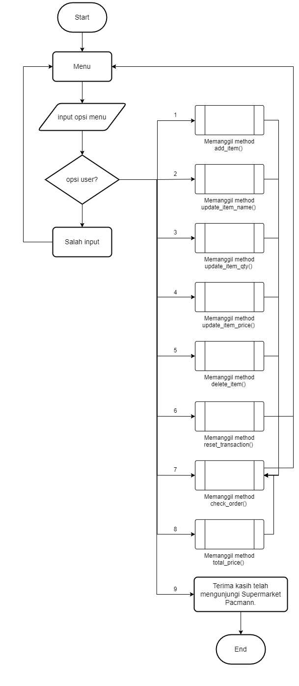
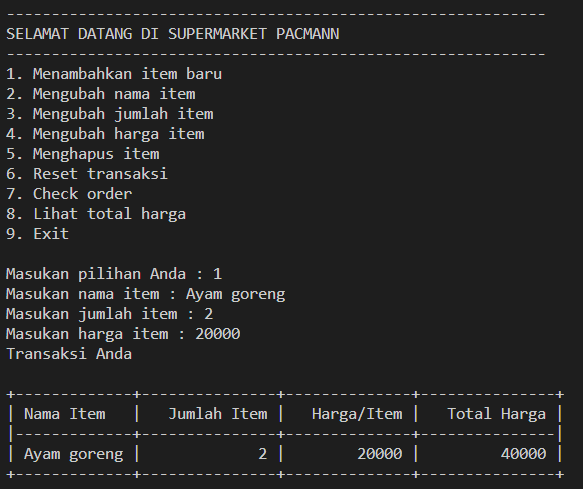
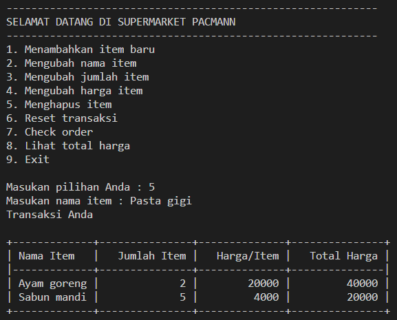
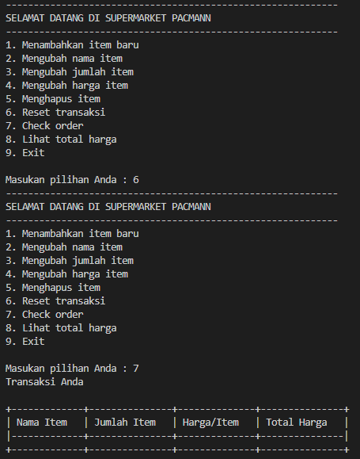
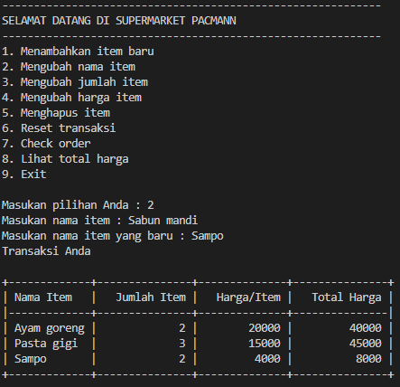
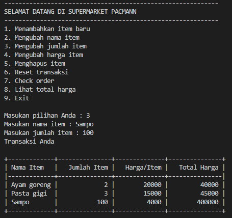
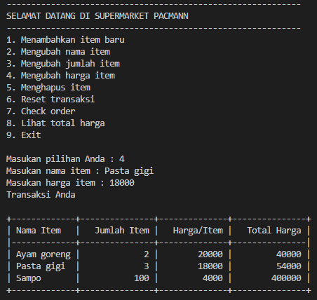
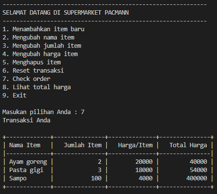
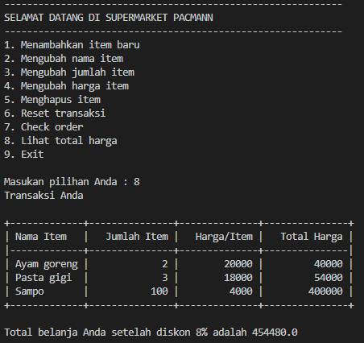
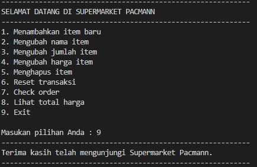

# Project Supermarket : Self-service Chasier

### A.Latar belakang project

Sistem kasir self-service adalah sistem untuk kebutuhan supemarket yang dirancang agar customer dapat menginputkan secara mandiri produk yang ingin dibelinya. Sistem tersebut membebaskan customer untuk memasukkan item yang ingin dibeli, kuantitas item, dan harga per item yang ingin dibeli. Selain itu, customer dapat meng-update data transaksi yang telah dibuat jika ingin membuat perubahan, misalnya mengganti data item, kuantitas item, atau pun data harga per item. Customer dapat menghapus item yang tidak jadi dibeli dengan cara men-delete salah satu item atau pun dapat me-reset data transaksi secara keseluruhan. Kemudian, customer dapat menampilkan data order yang sebelumnya telah di-input dan menampilkan total harga dari semua item yang dipilih.

### B. Requirements / Objecttives

1.	Membuat sistem kasir self-service yang dapat memudahkan customer untuk melakukan aksi berupa:
    - Menambah item yang ingin dibeli beserta kuantitas item dan harga item tersebut
    - Mengubah nama item yang ingin dibeli
    - Mengubah kuantitas item yang dipilih
    - Mengubah harga item yang dipilih
    - Menghapus item yang tidak jadi dibeli
    - Me-reset semua data transaksi
    - Mengecek data order yang sudah dibuat
    - Melihat total harga keseluruhan item yang dipilih
2.	Membuat project sistem kasir self-service menggunakan bahasa pemrograman Python
3.	Mengimplementasikan materi function, branching, dan data structure 
4.	Mengimplementasikan konsep OOP dalam program yang dirancang
5.	Mengaplikasikan clean code yang berlandaskan PEP8

### C. Flowchart

### D. Function dan atribut

1. `data_transc`       : Atribut yang berupa dictionary yang berfungsi untuk menyimpan data transaksi yang dilakukan oleh customer
2. `add_item`          : Method yang berfungsi untuk menambahkan list produk yang telah dimasukkan oleh customer yang berisi nama item, kuantitas item, dan harga item
3. `update_item_name`  : Method yang berguna untuk mengubah nama item yang ingin diganti
4. `update_item_qty`   : Method yang berguna untuk mengubah kuantitas item yang di-order
5. `update_item_price` : Method yang berfungsi untuk mengubah harga item yang dibeli
6. `delete_item`       : Method yang digunakan untuk menghapus item tertentu
7. `reset_transaction` : Method yang digunakan untuk menghapus seluruh data transaksi
8. `check_order`       : Method yang berfungsi untuk menampilkan seluruh data transaksi yang telah dibuat
9. `total_price`       : Method yang digunakan untuk menampilkan total harga seluruh produk 

### E. Test Case

__Test case 1__

Menambahkan item dengan method `add_item`

__Test case 2__

Menghapus item dengan method `delete_item`

__Test case 3__

Menghapus semua data transaksi dengan method `reset_transaction`

__Test case 4__

Mengubah nama produk dengan method `update_item_name`

__Test case 5__

Mengubah kuantitas produk dengan method `update_item_qty`

__Test case 6__

Mengubah harga produk dengan method `update_item_price`

__Test case 7__

Mengecek data order dengan method `check_order`

__Test case 8__

Menampilkan total belanja dengan method `total_price`

__Test case 9__

Keluar dari program kasir self-service

### F. Kesimpulan

Sistem kasir self-service memiliki fungsi utama untuk membantu customer agar dapat memasukkan order produk secara mandiri. Sejauh ini sistem sudah berjalan dengan lancar tetapi masih dapat diperbaiki agar performa sistem meningkat, misalnya:
1.	Menyimpan data transaksi menggunakan database
2.	Membuat user interface lebih interaktif menggunakan GUI (graphical user interface)

__Author__
Copyright (c) _2022_ _Santiana_
